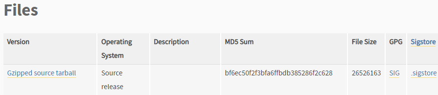

# GoormIDE Python Version Update

## 구름ide 파이썬 버전 업데이트

---

# 업데이트를 시작해보자.


▶작성시점 기준(2023-07-24)으로 작성되었습니다.ssss

구름IDE의 우분투18.04LTS 컨테이너 생성시 파이썬 버전이 3.7.4로 설치되어 있습니다. 

최신버전은 3.11.4임을 생각하면 구버전을 사용하고 있습니다.

먼저 관리자 권한을 통해 apt를 업데이트 해줍니다.

```bash
sudo apt-get update
```


그럴경우 두가지의 오류가 발생하는데요, 먼저 “NO_PUBKEY 536F8F1DE80F6A35”

이 오류는 퍼블릭키가 없는 상태라서 발생하는데요, 다음 코드를 입력하시면 됩니다.

```bash
sudo apt-key adv --keyserver keyserver.ubuntu.com --recv-keys 536F8F1DE80F6A35
```

서명이 올바르지 않습니다 오류는 다음 코드를 입력해주세요.

```bash
wget -q -O - https://packages.cloudfoundry.org/debian/cli.cloudfoundry.org.key | apt-key add -
```

다시 업데이트를 실행하면 오류없이 진행됩니다.

```bash
sudo apt-get update
```

나머지도 설치해주세요.

```bash
sudo apt-get upgrade
sudo apt-get dist-upgrade 
sudo apt-get install build-essential python-dev python-setuptools python-pip python-smbus  
sudo apt-get install libncursesw5-dev libgdbm-dev libc6-dev  
sudo apt-get install zlib1g-dev libsqlite3-dev tk-dev  
sudo apt-get install libssl-dev openssl  
```

중간중간 Y/n을 물을땐 y입력하고 엔터 누르시면 됩니다.

---

## 파이썬 설치

[Download Python](https://www.python.org/downloads/)

파이썬을 설치하기 위해서 들어가주세요.


원하는 버전을 선택하고 다운로드를 눌러주세요.

페이지 맨 아래로 내리고



“Gzipped source tarball” 의 다운로드 링크를 복사해주세요.

그리고 wget “다운로드 주소”를 입력해주세요. 예시는 3.11.4입니다.

```bash
wget https://www.python.org/ftp/python/3.11.4/Python-3.11.4.tgz
```

다운로드 된것을 확인하고 압축을 풀어주세요. 예시 입니다.

```bash
tar xvfz Python-3.11.4.tgz
```

해당 폴더로 디렉토리 이동을 하고, configure 해주세요. 예시는 입니다.

```bash
cd Python-3.11.4
./configure
make
su root
make install
```

좌측 하단 기본설정>터미널>프로필로 가서 코드를 추가합니다.

```bash
alias python3='/usr/local/bin/python3.11'
```


---

이제 버전을 확인해봅니다.

```bash
python -V
pip -V
```


설치 완료입니다.